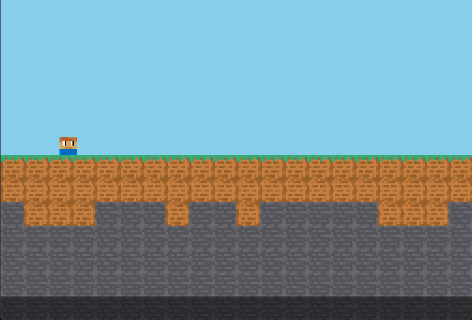

# Custom World Generation

In **main.py** find this parameter:

```python
# Генерация мира
WORLD_LAYOUT = [
    "00000000000000000000",
    "11111111111111111111",
    "44444444444444444444",
    "22222222222222222222",
    "22222222222222222222",
    "22222222222222222222",
    "33333333333333333333"
]
```

Here is the ID table:

* 0 - Grass Block (grass\_block.png)
* 1 = Dirt Block (dirt.png)
* 2 = Stone Block (stone.png)
* 3 = Bedrock (bedrock.png)

Here is the table of ID(combined blocks)

* 4 = Dirt/Stone (dirt.png or stone.png)


You <mark style="color:green;">**can**</mark> add new layers!


Default generation:

<figure><figcaption></figcaption></figure>

Modified generation:

<figure><figcaption><p>Stone world lol :D</p></figcaption></figure>

```python
# Stone World Generation Code
WORLD_LAYOUT = [
    "             2222222",
    "         22222222222",
    "22222222222222222222",
    "22222222222222222222",
    "22222222222222222222",
    "22222222222222222222",
    "22222222222222222222",
    "22222222222222222222",
    "22222222222222222222",
    "22222222222222222222"
]
```

